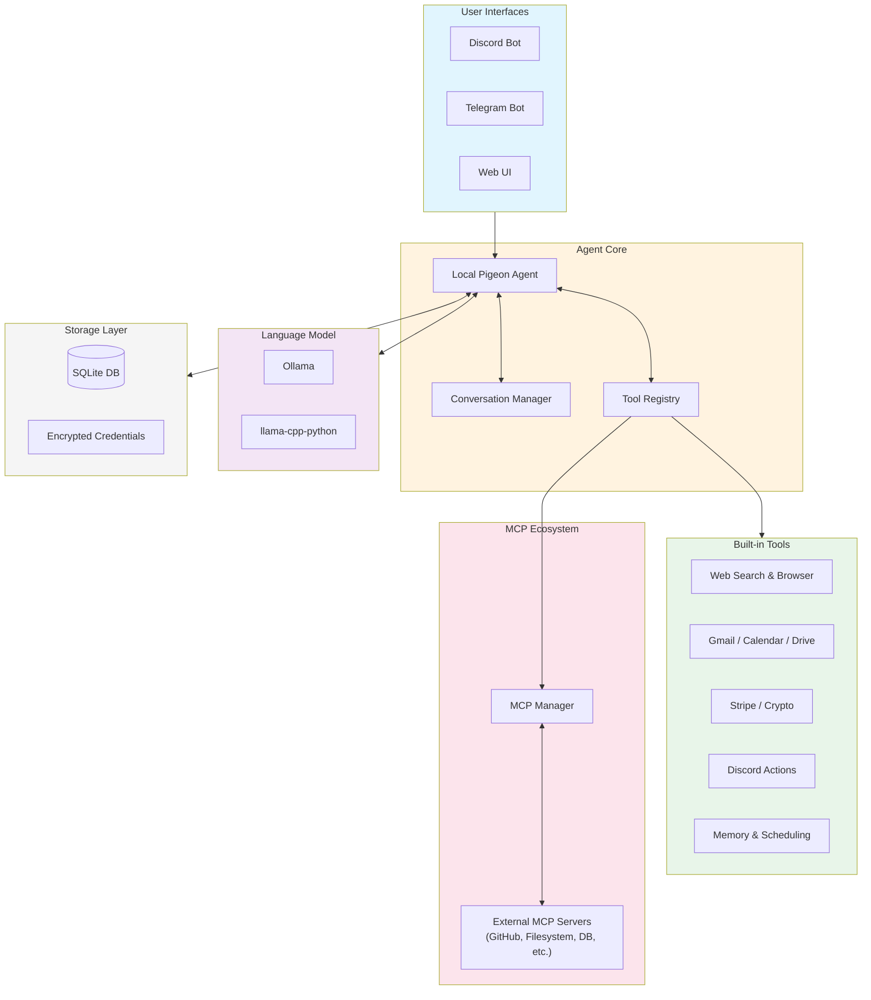

# Local Pigeon

```
  _                     _   ____  _                       
 | |    ___   ___ __ _| | |  _ \(_) __ _  ___  ___  _ __  
 | |   / _ \ / __/ _` | | | |_) | |/ _` |/ _ \/ _ \| '_ \ 
 | |__| (_) | (_| (_| | | |  __/| | (_| |  __/ (_) | | | |
 |_____\___/ \___\__,_|_| |_|   |_|\__, |\___|\___/|_| |_|
                                   |___/                  
```

**A fully local AI agent powered by Ollama (or llama-cpp-python).** Your AI assistant that runs entirely on your device, connecting to Discord, Telegram, or a web interface while keeping all LLM inference local and private.

[](https://pypi.org/project/local-pigeon/)
[](https://www.python.org/downloads/)
[](https://opensource.org/licenses/MIT)

## Features

- **Local LLM Inference** - Uses Ollama for on-device model inference
- **Privacy First** - Your conversations never leave your device
- **Multi-Platform** - Discord, Telegram, and Web UI support
- **MCP Integration** - Connect to the Model Context Protocol tool ecosystem
- **Extensible Tools** - Web search, browser automation, and more
- **Browser Automation** - Navigate dynamic websites with Playwright (Google Flights, etc.)
- **Voice Input** - Speech-to-text for hands-free interaction
- **Vision Support** - Image analysis with vision models (LLaVA, Moondream)
- **Model Catalog** - Curated inventory of thinking, vision, and coding models
- **Google Workspace** - Gmail, Calendar, and Drive integration
- **Payment Capabilities** - Stripe virtual cards and crypto (USDC/ETH)
- **Human-in-the-Loop** - Approval workflow for sensitive operations
- **Activity Dashboard** - Track interactions across all platforms
- **Easy Setup** - One-command installation

## Architecture



## Prerequisites

- **Python 3.10+** ([Download](https://www.python.org/downloads/))
- **Ollama** ([Download](https://ollama.ai)) - *or Local Pigeon can auto-download models via llama-cpp-python*
- A supported LLM model (e.g., `gemma3`, `llama3.2`, `qwen2.5`)

## Quick Start

### Option 1: Auto-Installer (Recommended)

**Windows (PowerShell):**
```powershell
irm https://raw.githubusercontent.com/tradermichael/local_pigeon/main/install.ps1 | iex
```

**Mac/Linux:**
```bash
curl -sSL https://raw.githubusercontent.com/tradermichael/local_pigeon/main/install.sh | bash
```

### Option 2: pip Install

```bash
pip install local-pigeon

# Optional features:
pip install local-pigeon[browser]  # Browser automation (Playwright)
pip install local-pigeon[voice]    # Voice input (Speech Recognition)
pip install local-pigeon[all]      # Everything
```

### Option 3: From Source

```bash
git clone https://github.com/tradermichael/local_pigeon.git
cd local_pigeon
pip install -e .
```

### Option 4: Docker

```bash
docker-compose up -d
```

## Configuration

### 1. Set up Ollama (or skip for auto-download)

If you have Ollama installed, make sure it's running:

```bash
# Start Ollama (if not running)
ollama serve

# Pull a model
ollama pull gemma3:latest
```

**No Ollama?** Local Pigeon will automatically fall back to llama-cpp-python and download a model from HuggingFace on first run.

### 2. Configure Local Pigeon

Run the setup wizard:

```bash
local-pigeon setup
```

Or manually create a `.env` file:

```env
# Ollama
OLLAMA_HOST=http://localhost:11434
OLLAMA_MODEL=gemma3:latest

# Discord (optional)
DISCORD_BOT_TOKEN=your_discord_bot_token

# Telegram (optional)
TELEGRAM_BOT_TOKEN=your_telegram_bot_token

# Google Workspace (optional)
GOOGLE_CLIENT_ID=your_client_id
GOOGLE_CLIENT_SECRET=your_client_secret

# Browser automation (optional)
BROWSER_ENABLED=true
BROWSER_HEADLESS=true  # false to see browser window

# Payments (optional)
STRIPE_API_KEY=sk_...
PAYMENT_APPROVAL_THRESHOLD=25.00
```

### 3. Run Local Pigeon

```bash
# Start all enabled platforms
local-pigeon run

# Or run specific platform
local-pigeon run --platform discord
local-pigeon run --platform telegram
local-pigeon run --platform web
```

## Model Catalog

Local Pigeon includes a curated catalog of models organized by capability:

| Category | Models | Use Case |
|----------|--------|----------|
| **Thinking/Reasoning** | DeepSeek R1, Qwen 3, Kimi K2 | Complex problem solving, chain-of-thought |
| **Vision** | LLaVA, Moondream, Llama 3.2 Vision | Image analysis, OCR |
| **Coding** | Qwen 2.5 Coder, CodeLlama, DeepSeek Coder | Code generation, debugging |
| **General** | Gemma 3, Llama 3.2, Mistral | General conversation |
| **Small/Fast** | Qwen 2.5 0.5B-3B, Phi-3 Mini | Quick responses, low resources |

Install models via the Web UI (Settings > Model Discovery) or command line:

```bash
# Reasoning model
ollama pull deepseek-r1:7b

# Vision model (for image analysis)
ollama pull llava:7b

# Coding model
ollama pull qwen2.5-coder:7b
```

## Platforms

### Discord Bot

1. Create a bot at [Discord Developer Portal](https://discord.com/developers/applications)
2. Enable "Message Content Intent" under Bot settings
3. Copy the bot token to your `.env`
4. Invite the bot to your server with appropriate permissions

**Features:**
- Responds to mentions and DMs
- Streaming responses with message edits
- Slash commands: `/model`, `/clear`, `/status`
- Payment approval via DM
- Image analysis (send images for vision models to analyze)

### Telegram Bot

1. Create a bot via [@BotFather](https://t.me/BotFather)
2. Copy the bot token to your `.env`
3. Optionally set `TELEGRAM_ALLOWED_USERS` to restrict access

**Features:**
- Message handling with user whitelist
- Streaming responses
- Commands: `/model`, `/clear`, `/status`
- Inline keyboard for payment approvals

### Web UI

Access at `http://localhost:7860` when running with `--platform web`.

**Features:**
- Chat interface with streaming
- **Tool activity transparency** - See which tools the agent uses in real-time
- Voice input (microphone)
- Activity log across all platforms
- Model discovery and installation
- Settings panel
- OAuth setup for Google

## Tools

### Web Tools
- **Web Search** - Search using DuckDuckGo
- **Web Fetch** - Extract content from web pages
- **Browser** - Full browser automation (Playwright)
- **Browser Search** - Specialized search tasks (Google Flights, etc.)

### Google Workspace
- **Gmail** - Read, search, and send emails
- **Calendar** - View and create events
- **Drive** - List, search, and read files

### Payments
- **Stripe Card** - Virtual card for online payments
- **Crypto Wallet** - USDC/ETH on Base network

### Discord Tools
- **Send Messages** - Post to channels
- **Send DMs** - Direct message users
- **Get Messages** - Read channel history
- **Add Reactions** - React to messages
- **List Channels** - See available channels
- **Create Threads** - Start discussion threads

## MCP Integration

Local Pigeon supports the [Model Context Protocol (MCP)](https://modelcontextprotocol.io/) - an open standard for connecting AI agents to external tools and data sources.

### What is MCP?

MCP allows Local Pigeon to dynamically discover and use tools from external servers. This means you can extend your agent's capabilities without modifying core code.

### Popular MCP Servers

| Server | Description | Transport |
|--------|-------------|-----------|
| **brave-search** | Web search via Brave API | stdio |
| **github** | GitHub repository operations | stdio |
| **filesystem** | Local file system access | stdio |
| **postgres** | PostgreSQL database queries | stdio |
| **fetch** | HTTP requests & web content | stdio |
| **memory** | Persistent key-value storage | stdio |
| **puppeteer** | Browser automation | stdio |
| **slack** | Slack workspace integration | stdio |

### Configuration

Add MCP servers in `config.yaml`:

```yaml
mcp:
  enabled: true
  auto_approve: false  # require approval for MCP tool calls
  connection_timeout: 30
  
  servers:
    - name: filesystem
      transport: stdio
      command: npx
      args: ["-y", "@modelcontextprotocol/server-filesystem", "/path/to/allowed/dir"]
    
    - name: github
      transport: stdio
      command: npx
      args: ["-y", "@modelcontextprotocol/server-github"]
      env:
        GITHUB_PERSONAL_ACCESS_TOKEN: "${GITHUB_TOKEN}"
```

Or add servers via the Web UI: **Settings → Integrations → MCP Servers**

### Using MCP Tools

Once connected, MCP tools appear automatically in the agent's tool registry with the naming convention `mcp_{server}_{tool}`. For example:
- `mcp_github_create_issue`
- `mcp_filesystem_read_file`
- `mcp_postgres_query`

The agent can then use these tools naturally in conversations.

## Payment System

Local Pigeon supports both traditional and crypto payments:

### Stripe Virtual Cards
- Create virtual cards for online purchases
- Real-time transaction monitoring
- Human-in-the-loop approval for amounts above threshold

### Crypto Wallet (CDP)
- USDC and ETH support on Base network
- Send and receive payments
- Approval workflow for security

### Approval Workflow

Payments above your configured threshold (default: $25) require approval:

1. Agent requests payment
2. You receive approval request (Discord DM, Telegram message, or Web UI)
3. Approve or deny within 5 minutes
4. Payment proceeds or is cancelled

Configure threshold:
```env
PAYMENT_APPROVAL_THRESHOLD=25.00
```

## Security

- **Local Processing** - LLM runs on your device via Ollama
- **Encrypted Storage** - OAuth tokens encrypted at rest
- **Human Approval** - Sensitive operations require confirmation
- **User Whitelist** - Restrict bot access to specific users

## Project Structure

```
local_pigeon/
├── src/
│   └── local_pigeon/
│       ├── core/           # Agent, LLM client, conversation, model catalog
│       ├── platforms/      # Discord, Telegram adapters
│       ├── tools/          # Tool registry and implementations
│       │   ├── web/        # Search, fetch, browser automation
│       │   ├── google/     # Gmail, Calendar, Drive
│       │   ├── discord/    # Discord action tools
│       │   ├── payments/   # Stripe, crypto wallet
│       │   └── mcp/        # MCP server connections & adapters
│       ├── storage/        # Database, credentials
│       ├── ui/             # Gradio web interface
│       ├── config.py       # Configuration management
│       └── cli.py          # Command-line interface
├── config.yaml             # YAML configuration
├── .env.example            # Environment template
├── install.ps1             # Windows installer
├── install.sh              # Mac/Linux installer
├── Dockerfile              # Docker build
└── docker-compose.yml      # Docker orchestration
```

## Development

### Setup Development Environment

```bash
git clone https://github.com/tradermichael/local_pigeon.git
cd local_pigeon
pip install -e ".[dev]"
```

### Run Tests

```bash
pytest
```

### Code Style

```bash
ruff check .
ruff format .
```

## Commands Reference

```bash
# Run the agent
local-pigeon run [--platform discord|telegram|web]

# Interactive setup wizard
local-pigeon setup

# Check system status
local-pigeon status

# List available models
local-pigeon models

# Interactive chat (terminal)
local-pigeon chat

# Show version
local-pigeon version
```

## Contributing

Contributions are welcome! Please read our contributing guidelines.

1. Fork the repository
2. Create a feature branch
3. Make your changes
4. Submit a pull request

## License

MIT License - see [LICENSE](LICENSE) for details.

## Acknowledgments

- [Ollama](https://ollama.ai) - Local LLM runtime
- [Model Context Protocol](https://modelcontextprotocol.io/) - MCP tool ecosystem
- [Playwright](https://playwright.dev) - Browser automation
- [discord.py](https://discordpy.readthedocs.io/) - Discord API wrapper
- [aiogram](https://docs.aiogram.dev/) - Telegram Bot framework
- [Gradio](https://gradio.app) - Web UI framework
- [Stripe](https://stripe.com) - Payment processing
- [Coinbase CDP](https://docs.cdp.coinbase.com/) - Crypto infrastructure

---

**Made with care for local-first AI**
